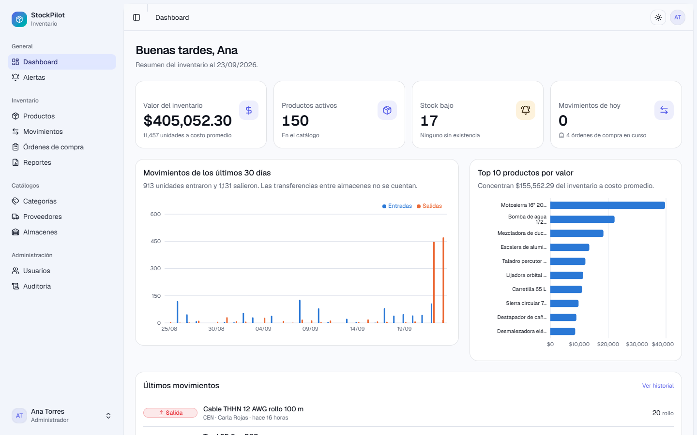
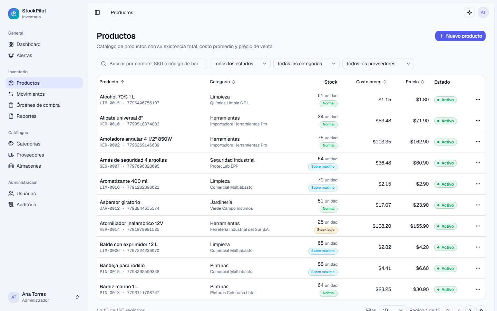
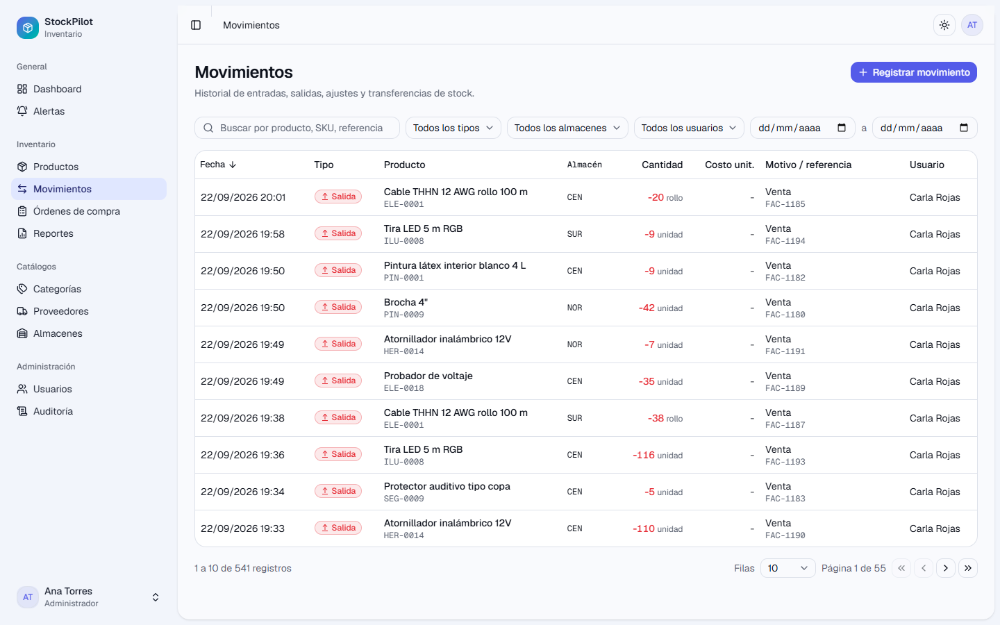
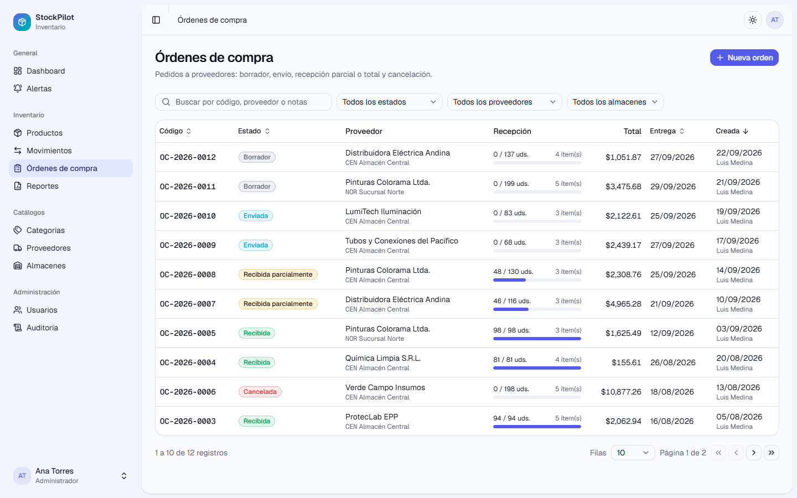
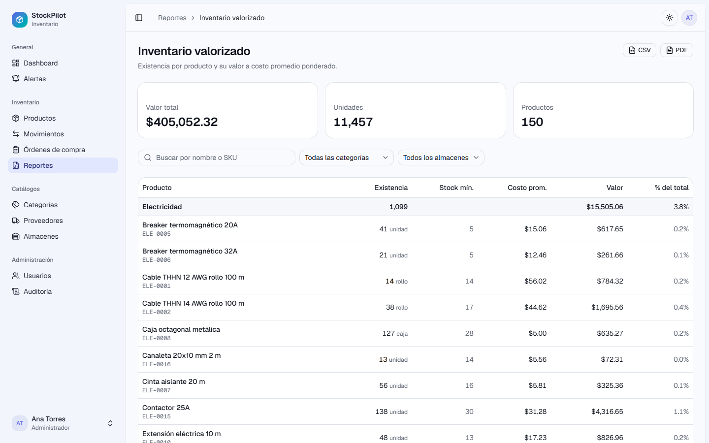
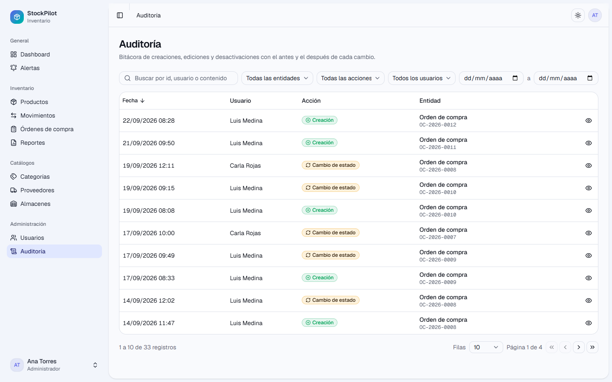

<div align="center">

# 📦 StockPilot

**Sistema de gestión de inventario para pequeñas y medianas empresas**

Control de stock en tiempo real, órdenes de compra, alertas de stock bajo y reportes valorizados.

[](https://nextjs.org/)
[](https://react.dev/)
[](https://www.typescriptlang.org/)
[](https://www.microsoft.com/sql-server)
[](https://www.prisma.io/)
[](https://tailwindcss.com/)
[](LICENSE)
[](https://github.com/blowerlol355-blip/invetario-project-/actions/workflows/ci.yml)

</div>

---

## 📸 Capturas de pantalla

| Dashboard                                    | Productos                                   |
| -------------------------------------------- | ------------------------------------------- |
|  |  |

| Movimientos                                    | Órdenes de compra                                          |
| ---------------------------------------------- | ---------------------------------------------------------- |
|  |  |

| Reportes                                  | Auditoría                                |
| ----------------------------------------- | ---------------------------------------- |
|  |  |

Las capturas se regeneran con `npm run screenshots` (Playwright, tras `npm run build`).

## ✨ Características

- **Control de stock por almacén** con entradas, salidas, ajustes y transferencias atómicas.
- **Sin stock negativo:** toda salida o transferencia se valida dentro de una transacción.
- **Órdenes de compra** con recepción parcial o total que genera movimientos automáticamente.
- **Alertas de stock bajo** con acción rápida para crear una orden de compra.
- **Dashboard** con KPIs, gráfica de movimientos de 30 días y top de productos por valor.
- **Reportes** de inventario valorizado (costo promedio ponderado), kardex y movimientos, con
  exportación a CSV y PDF.
- **Roles y permisos** (ADMIN, MANAGER, OPERATOR) protegidos en middleware y en cada acción.
- **Gestión de usuarios** (solo ADMIN): roles, contraseñas, activación y claves de API.
- **Auditoría** de toda creación, edición y eliminación, con bitácora filtrable y diff
  campo a campo.
- **API REST pública** `/api/v1` (productos, stock y movimientos) con claves de API por usuario,
  rate limiting y documentación interactiva en `/api-docs` (OpenAPI 3.1).
- **Modo claro/oscuro**, diseño responsivo y accesible, animaciones sutiles.

## 🛠️ Stack tecnológico

| Capa          | Tecnología                                               |
| ------------- | -------------------------------------------------------- |
| Framework     | Next.js 15 (App Router), React 19, TypeScript estricto   |
| Base de datos | Microsoft SQL Server 2022 (instancia local o remota)     |
| ORM           | Prisma 7 con driver adapter para SQL Server              |
| Autenticación | Auth.js v5 (credenciales, bcrypt, sesiones JWT)          |
| UI            | Tailwind CSS v4, shadcn/ui, lucide-react, motion         |
| Formularios   | React Hook Form + Zod                                    |
| Tablas        | TanStack Table (paginación, orden y filtros en servidor) |
| Gráficas      | Recharts                                                 |
| Testing       | Vitest + Testing Library, Playwright                     |
| Calidad       | ESLint, Prettier, Husky, lint-staged, commitlint         |
| CI            | GitHub Actions                                           |

## 📋 Requisitos

- [Node.js](https://nodejs.org/) 20.19 o superior (recomendado 24, ver `.nvmrc`)
- [SQL Server 2022](https://www.microsoft.com/sql-server/sql-server-downloads) Developer o Express instalado localmente, con autenticación SQL (usuario `sa`) y TCP habilitado en el puerto 1433
- npm 10 o superior

## 🚀 Instalación

```bash
# 1. Clonar el repositorio
git clone https://github.com/blowerlol355-blip/invetario-project-.git
cd invetario-project-

# 2. Instalar dependencias (también genera el cliente Prisma)
npm install

# 3. Configurar variables de entorno
cp .env.example .env
# Edita .env y cambia AUTH_SECRET por un valor aleatorio:  npx auth secret

# 4. Crear la base de datos "stockpilot" en tu instancia de SQL Server (una sola vez)
npm run db:create

# 5. Aplicar migraciones y cargar datos de prueba
npm run db:migrate
npm run db:seed

# 6. Iniciar el servidor de desarrollo
npm run dev
```

Abre [http://localhost:3000](http://localhost:3000).

## 🔐 Variables de entorno

| Variable              | Descripción                                    | Ejemplo                                   |
| --------------------- | ---------------------------------------------- | ----------------------------------------- |
| `NODE_ENV`            | Entorno de ejecución                           | `development`                             |
| `DATABASE_URL`        | Cadena de conexión de Prisma a SQL Server      | `sqlserver://localhost:1433;database=...` |
| `AUTH_SECRET`         | Secreto para firmar JWT (mínimo 32 caracteres) | `openssl rand -base64 32`                 |
| `AUTH_URL`            | URL pública de la app (opcional en desarrollo) | `http://localhost:3000`                   |
| `SKIP_ENV_VALIDATION` | Omite la validación de entorno (útil en CI)    | `true`                                    |

Todas se validan con Zod al arrancar; si falta alguna, la app no inicia y muestra qué corregir.

## 📜 Scripts

| Script                  | Descripción                                  |
| ----------------------- | -------------------------------------------- |
| `npm run dev`           | Servidor de desarrollo con Turbopack         |
| `npm run build`         | Build de producción                          |
| `npm run start`         | Sirve el build de producción                 |
| `npm run lint`          | Ejecuta ESLint                               |
| `npm run format`        | Formatea con Prettier                        |
| `npm run typecheck`     | Verifica tipos con TypeScript                |
| `npm run test`          | Tests unitarios con Vitest                   |
| `npm run test:coverage` | Tests con reporte de cobertura               |
| `npm run test:e2e`      | Tests E2E con Playwright (tras `build`)      |
| `npm run test:e2e:ui`   | Playwright en modo interactivo               |
| `npm run screenshots`   | Regenera las capturas del README             |
| `npm run db:create`     | Crea la base de datos si no existe           |
| `npm run db:migrate`    | Crea y aplica migraciones (desarrollo)       |
| `npm run db:seed`       | Carga datos de prueba                        |
| `npm run db:studio`     | Abre Prisma Studio                           |
| `npm run db:reset`      | Reinicia la base de datos y vuelve a sembrar |

## 👤 Usuarios demo

Se crean con `npm run db:seed` y aparecen en la pantalla de login: un clic rellena las credenciales.

| Rol      | Correo                    | Contraseña     |
| -------- | ------------------------- | -------------- |
| ADMIN    | `admin@stockpilot.dev`    | `Admin123!`    |
| MANAGER  | `manager@stockpilot.dev`  | `Manager123!`  |
| OPERATOR | `operator@stockpilot.dev` | `Operator123!` |

## 📁 Estructura del proyecto

```
src/
├── app/                # Rutas (App Router): (auth), (dashboard), api
├── components/         # ui (shadcn), forms, tables, charts, layout, providers
├── features/<módulo>/  # actions, queries, schemas y componentes por módulo
├── lib/                # db, env, auth, permisos, utilidades
└── types/              # tipos compartidos
prisma/                 # schema, migraciones y seed
scripts/                # utilidades de desarrollo (creación de la base de datos)
tests/                  # unit (Vitest) y e2e (Playwright)
docs/                   # arquitectura, base de datos, reglas de negocio, API, ADRs
```

## 🧪 Pruebas

- **Unitarias** (Vitest + Testing Library): reglas de negocio puras (movimientos, stock negativo,
  costo promedio, recepción de órdenes, usuarios), esquemas Zod, permisos, formato y mapeo de
  errores; el servicio de stock se prueba con un doble de base de datos en memoria.
  `npm run test:coverage` genera el reporte en `coverage/`.
- **Coherencia de la API**: un test comprueba que `openapi.yaml` y las rutas de `/api/v1`
  coincidan.
- **E2E** (Playwright, Chromium): login y permisos por rol, alta de producto, entrada, salida y
  transferencia de stock, y recepción de una orden de compra. Corren contra el build de producción
  y la base local sembrada; los datos que crean (`E2E-*`) se eliminan al terminar. Además fallan
  si el navegador reporta errores de consola o violaciones de la CSP.

```bash
npx playwright install chromium   # una sola vez
npm run build && npm run test:e2e
```

Si prefieres no descargar Chromium, usa el navegador instalado:
`PLAYWRIGHT_CHANNEL=chrome npm run test:e2e` (o `msedge`).

## ☁️ Despliegue

La app se despliega en **Vercel** y la base de datos en **Azure SQL Database** (SQL Server
gestionado, sin cambios en el código). `vercel.json` fija el comando de build, que aplica las
migraciones antes de compilar. Variables necesarias en Vercel: `DATABASE_URL`, `AUTH_SECRET` y
`TZ`. Guía completa en [docs/DEPLOY.md](docs/DEPLOY.md).

## ⚙️ Integración continua

`.github/workflows/ci.yml` ejecuta en cada push y pull request:

1. **quality**: lint, formato, tipos, tests unitarios con cobertura y build.
2. **e2e**: instala SQL Server 2022 de forma nativa en el runner (sin contenedores), crea la base,
   migra, siembra y ejecuta Playwright; el reporte HTML queda como artefacto.

## 📚 Documentación

| Documento                                             | Contenido                                           |
| ----------------------------------------------------- | --------------------------------------------------- |
| [docs/ARCHITECTURE.md](docs/ARCHITECTURE.md)          | Capas, flujo de una petición, seguridad y extensión |
| [docs/DATABASE.md](docs/DATABASE.md)                  | Diagrama entidad-relación y tablas                  |
| [docs/BUSINESS_RULES.md](docs/BUSINESS_RULES.md)      | Reglas de negocio numeradas                         |
| [docs/API.md](docs/API.md) · [`/api-docs`](/api-docs) | API REST v1, autenticación y ejemplos               |
| [docs/DEPLOY.md](docs/DEPLOY.md)                      | Despliegue en Vercel con Azure SQL Database         |
| [docs/adr/](docs/adr/)                                | Decisiones de arquitectura (stack, auth, API)       |
| [CONTRIBUTING.md](CONTRIBUTING.md)                    | Cómo contribuir y convenciones                      |
| [CHANGELOG.md](CHANGELOG.md)                          | Historial de cambios                                |

## 🗺️ Roadmap

- [x] **Fase 1:** setup del proyecto, tooling, SQL Server y Prisma conectado
- [x] **Fase 2:** esquema de base de datos, migraciones y seed
- [x] **Fase 3:** autenticación, roles, middleware y layout principal
- [x] **Fase 4:** catálogos (categorías, proveedores, almacenes)
- [x] **Fase 5:** productos con tabla avanzada y detalle
- [x] **Fase 6:** movimientos de stock con transacciones
- [x] **Fase 7:** órdenes de compra y alertas
- [x] **Fase 8:** dashboard y reportes con exportación
- [x] **Fase 9:** usuarios, auditoría y API REST con OpenAPI
- [x] **Fase 10:** tests E2E, CI, documentación final y pulido visual

Ideas para después de la 1.0: múltiples claves de API con caducidad, notificaciones por correo de
stock bajo, importación masiva de productos por CSV y despliegue en Azure App Service.

## 📄 Licencia

Distribuido bajo la licencia MIT. Consulta [LICENSE](LICENSE) para más información.

---

<div align="center">Hecho por <strong>Blower Bosques</strong></div>
