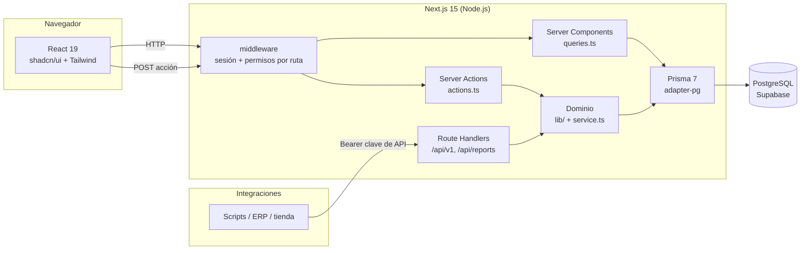

# Arquitectura de StockPilot

Documento de referencia para entender cómo está organizado el sistema, qué decisiones lo
sostienen y por dónde se extiende. Las decisiones individuales están en `docs/adr/`.

## Visión general

StockPilot es una aplicación **Next.js 15 (App Router)** de una sola pieza: el mismo proceso sirve
la interfaz (React Server Components + Client Components), las mutaciones (Server Actions), la API
REST pública (Route Handlers) y las exportaciones. La base de datos es **PostgreSQL** (Supabase)
accedida con **Prisma 7** mediante el driver adapter `@prisma/adapter-pg`.

## Capas y responsabilidades

| Capa                 | Dónde                                      | Qué hace                                                                                            |
| -------------------- | ------------------------------------------ | --------------------------------------------------------------------------------------------------- |
| Rutas y páginas      | `src/app/**`                               | Composición de pantallas. Leen `searchParams`, consultan y renderizan. Sin lógica de negocio.       |
| Consultas            | `src/features/<módulo>/queries.ts`         | Lecturas con Prisma (o SQL crudo para agregados). Convierten `Decimal` a `number`. `server-only`.   |
| Mutaciones           | `src/features/<módulo>/actions.ts`         | Server Actions: permiso, validación Zod, transacción + auditoría, `revalidatePath`, `ActionResult`. |
| Servicios de dominio | `src/features/<módulo>/service.ts`, `lib/` | Reglas compartidas entre UI y API (`applyStockMovement`, `createProduct`, `planReceipt`...).        |
| Esquemas             | `src/features/<módulo>/schemas.ts`         | Zod compartido entre React Hook Form, Server Actions y API.                                         |
| Componentes          | `src/features/<módulo>/components/`        | Tablas, formularios y diálogos del módulo. `"use client"` solo cuando hace falta.                   |
| Transversal          | `src/lib/`                                 | Prisma, env, auth, permisos, navegación, formato, auditoría, transacciones, rate limiting.          |
| API pública          | `src/app/api/v1/**` + `src/features/api/`  | Route Handlers finos sobre el dominio; autenticación por clave o sesión; errores uniformes.         |

Regla de dependencia: las páginas dependen de `features`, `features` de `lib`, y nada depende de
`app`. Un módulo no importa componentes de otro módulo salvo piezas compartidas explícitas
(`ProductCombobox`, badges) que viven en `src/components/`.

## Flujo de una petición

1. **Middleware** (`src/middleware.ts`, runtime Edge): valida el JWT de Auth.js, redirige al login
   sin sesión y a `/forbidden` si el rol no tiene el permiso de la sección
   (`src/lib/navigation.ts` es la única definición de rutas, etiquetas y permisos). Las rutas
   `/api/v1`, `/api-docs` y `/openapi.yaml` son públicas: la API se autentica sola.
2. **Página** (Server Component): `parseListParams(searchParams)` normaliza paginación, orden,
   búsqueda y filtros; llama a `queries.ts`; renderiza `PageHeader` + tabla/formulario.
3. **Interacción**: la tabla escribe su estado en la URL (`useTableParams`) y la página se vuelve a
   ejecutar en el servidor. Un formulario llama a una Server Action con `useActionForm`.
4. **Server Action**: `requirePermission` → `schema.parse` → `prisma.$transaction` (cambio +
   `recordAudit`) → `revalidatePath` → `ok()` / `toActionError()`. Nunca lanza al cliente.
5. **API REST**: `apiRoute()` autentica (`Authorization: Bearer` o cookie), aplica rate limiting,
   comprueba el permiso, ejecuta el handler y mapea excepciones a `{ error: { code, message } }`.

## Modelo de datos y reglas

- Diagrama y tablas en `docs/DATABASE.md`; reglas de negocio en `docs/BUSINESS_RULES.md`.
- **El stock solo cambia a través de movimientos.** `applyStockMovement(tx, command)` es la única
  función que escribe en `stocks`; la UI, la recepción de órdenes de compra y la API la invocan
  dentro de una transacción serializable con reintentos (`withSerializableTransaction`).
- **Sin stock negativo por construcción**: la resta es un `updateMany` condicional
  (`quantity >= n`) y un CHECK en la tabla lo refuerza.
- **Costo promedio ponderado** recalculado en cada entrada con costo (`calculateWeightedAverageCost`).
- **Auditoría** en la misma transacción que el cambio, con snapshots JSON sin campos sensibles.
- **Soft delete** en catálogos y usuarios; todas las FK son `NO ACTION`.

## Seguridad

- Auth.js v5 con credenciales y bcrypt; sesión JWT de 8 h (ADR 0002).
- Permisos granulares por rol (`src/lib/permissions.ts`) verificados en middleware, Server Actions
  y Route Handlers; la UI solo oculta.
- Claves de API por usuario con hash SHA-256 (ADR 0003); rate limiting en login y API.
- Cabeceras de seguridad y **CSP en modo estricto** en `next.config.ts`; los tests E2E fallan ante
  cualquier violación reportada por el navegador.
- Variables de entorno validadas con Zod al arrancar; los errores internos nunca llegan al cliente.

## Frontend

- **Server Components por defecto**; `"use client"` solo para estado, efectos y librerías cliente.
- Tablas 100 % server-side con TanStack Table v8 (`DataTable` genérica).
- Formularios con React Hook Form + Zod; los esquemas no usan `transform` para que el tipo de
  entrada y salida coincida.
- Tokens semánticos de Tailwind v4 (`primary`, `success`, `warning`, `info`, `destructive`) y modo
  claro/oscuro con `next-themes`; animaciones con `tw-animate-css` y `motion` respetando
  `prefers-reduced-motion`.
- Gráficas con Recharts siguiendo una paleta validada para daltonismo (`--viz-series-*`).

## Pruebas

| Nivel      | Herramienta              | Qué cubre                                                                                                                  |
| ---------- | ------------------------ | -------------------------------------------------------------------------------------------------------------------------- |
| Unitario   | Vitest + Testing Library | Reglas de negocio puras, esquemas Zod, permisos, formato, mapeo de errores, servicio de stock con un doble en memoria      |
| Coherencia | Vitest                   | `openapi.yaml` frente a las rutas reales de `/api/v1`                                                                      |
| E2E        | Playwright               | Login y permisos, alta de producto, entrada/salida/transferencia, recepción de orden de compra, ausencia de errores de CSP |

Los tests E2E corren contra el build de producción y la base local sembrada; crean datos con el
prefijo `E2E-` y los eliminan al terminar (`tests/e2e/global-teardown.ts`).

## Integración continua

`.github/workflows/ci.yml` ejecuta lint, formato, tipos, tests con cobertura y build en cada push
y pull request, y un segundo job arranca el PostgreSQL preinstalado en el runner (servicio nativo, sin
contenedores), migra, siembra y ejecuta Playwright.

## Cómo extender

- **Nuevo módulo CRUD**: copiar el patrón de `src/features/categories/` (schemas, queries, actions,
  components) y registrar la sección en `src/lib/navigation.ts`; el middleware, el menú y las migas
  de pan se actualizan solos.
- **Nueva ruta de la API**: crear `src/app/api/v1/<recurso>/route.ts` con `apiRoute()`, reutilizar
  consultas/servicios, documentarla en `public/openapi.yaml` (el test de coherencia lo exige) y
  en `docs/API.md`.
- **Nueva regla de negocio**: implementarla como función pura en `lib/` con tests, invocarla desde
  la transacción y documentarla en `docs/BUSINESS_RULES.md`.
