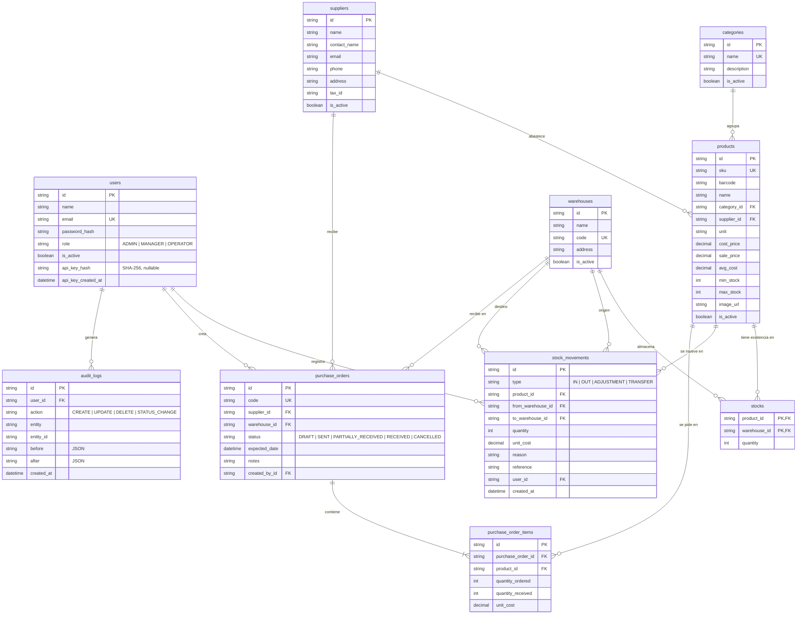

# Base de datos

StockPilot usa **Microsoft SQL Server 2022** con **Prisma 7** (`provider = "sqlserver"`). El esquema
vive en `prisma/schema.prisma` y las migraciones versionadas en `prisma/migrations/`.

## Diagrama entidad-relación

## Convenciones

- **Nombres:** modelos en PascalCase singular en Prisma; tablas en snake_case plural y columnas en
  snake_case en SQL Server (vía `@map`). El código TypeScript siempre usa camelCase.
- **Claves primarias:** UUID v4 generado por Prisma (`@default(uuid())`), salvo `stocks`, que usa
  la clave compuesta `(product_id, warehouse_id)`.
- **Montos:** `DECIMAL(12,2)` para precios y `DECIMAL(12,4)` para costos unitarios y promedio, para
  no perder precisión al promediar.
- **Cantidades:** enteros. Las unidades fraccionables (litros, kg) se modelan como envases
  contables (p. ej. "Detergente 5 L").
- **Timestamps:** `created_at` y `updated_at` en todas las tablas de negocio (`DATETIME2`).
- **Soft delete:** los catálogos (`users`, `categories`, `suppliers`, `warehouses`, `products`)
  se desactivan con `is_active = 0`; nunca se borran físicamente. Por eso todas las claves
  foráneas usan `ON DELETE NO ACTION`.

## Limitaciones del conector SQL Server y cómo se resuelven

| Limitación de Prisma en SQL Server       | Solución adoptada                                                                       |
| ---------------------------------------- | --------------------------------------------------------------------------------------- |
| No soporta `enum`                        | Columnas `VARCHAR` + constraints `CHECK` en la migración + tipos en `src/lib/domain.ts` |
| No soporta `Json`                        | `NVARCHAR(MAX)` con JSON serializado (`audit_logs.before/after`)                        |
| Índices únicos tratan `NULL` como valor  | `barcode` y `tax_id` son opcionales: su unicidad se valida en la aplicación             |
| `ON DELETE SET NULL` con rutas múltiples | Todas las relaciones usan `NO ACTION` (compatible con el soft delete)                   |

## Tablas

### users

Usuarios que inician sesión. `role` define los permisos (ver `docs/BUSINESS_RULES.md`).
`password_hash` guarda el hash bcrypt; nunca se expone al cliente. `api_key_hash` es el SHA-256
de la clave de API del usuario (nullable, con índice para la búsqueda en cada petición de
`/api/v1`) y `api_key_created_at` cuándo se generó; la clave en claro nunca se almacena. Migración
`20260923093313_add_user_api_key`.

### categories

Agrupación de productos. `name` es único.

### suppliers

Proveedores. `tax_id` es la identificación fiscal (RUC, NIT, RFC, CUIT...).

### warehouses

Almacenes o sucursales. `code` es un identificador corto y único (p. ej. `CEN`, `NOR`).

### products

Catálogo de productos.

| Columna      | Descripción                                                         |
| ------------ | ------------------------------------------------------------------- |
| `sku`        | Código interno único (`HER-0001`).                                  |
| `barcode`    | Código de barras opcional.                                          |
| `unit`       | Unidad de medida (`unidad`, `par`, `caja`, `paquete`, `rollo`...).  |
| `cost_price` | Costo de referencia (catálogo / última compra).                     |
| `sale_price` | Precio de venta.                                                    |
| `avg_cost`   | Costo promedio ponderado; se recalcula en cada entrada con costo.   |
| `min_stock`  | Umbral de alerta: la existencia total `<= min_stock` genera alerta. |
| `max_stock`  | Referencia para sugerir cantidades en órdenes de compra.            |

### stocks

Existencia actual de cada producto por almacén. **Solo se modifica dentro de la transacción
que registra un `stock_movement`**; nunca directamente.

### stock_movements

Historial inmutable de movimientos. `quantity` siempre es positiva; el sentido lo dan los
almacenes:

| Tipo         | `from_warehouse_id` | `to_warehouse_id` | Efecto                                   |
| ------------ | ------------------- | ----------------- | ---------------------------------------- |
| `IN`         | (vacío)             | requerido         | Suma en destino; `unit_cost` obligatorio |
| `OUT`        | requerido           | (vacío)           | Resta en origen                          |
| `TRANSFER`   | requerido           | requerido         | Resta en origen y suma en destino        |
| `ADJUSTMENT` | si disminuye        | si aumenta        | Exactamente uno de los dos               |

`reference` enlaza con el documento de respaldo (factura, ticket o código de orden de compra).

### purchase_orders y purchase_order_items

Órdenes de compra a proveedores con su ciclo de vida
(`DRAFT -> SENT -> PARTIALLY_RECEIVED -> RECEIVED`, o `CANCELLED`). Cada recepción genera
movimientos `IN` con `reference = code` y actualiza `quantity_received` de los ítems.
`sent_at`, `received_at` y `cancelled_at` registran la línea de tiempo.

### audit_logs

Bitácora de creación, edición, eliminación y cambios de estado. `before` y `after` guardan el
snapshot JSON de los campos relevantes. `user_id` es opcional para acciones del sistema.

## Datos de prueba

`npm run db:seed` ejecuta `prisma/seed.ts`, que genera de forma **determinista** (semilla fija):

- 3 usuarios (uno por rol), 8 categorías, 10 proveedores, 3 almacenes y 150 productos.
- ~500 movimientos en los últimos 90 días (inventario inicial, ventas, compras, transferencias
  y ajustes) y 12 órdenes de compra en todos los estados.
- Las existencias y el costo promedio **se derivan reproduciendo los movimientos** con las
  mismas reglas de negocio de la aplicación, por lo que kardex, stock y valorización son
  coherentes entre sí desde el primer arranque.
- 15 productos quedan por debajo de su stock mínimo para poblar el módulo de alertas.
